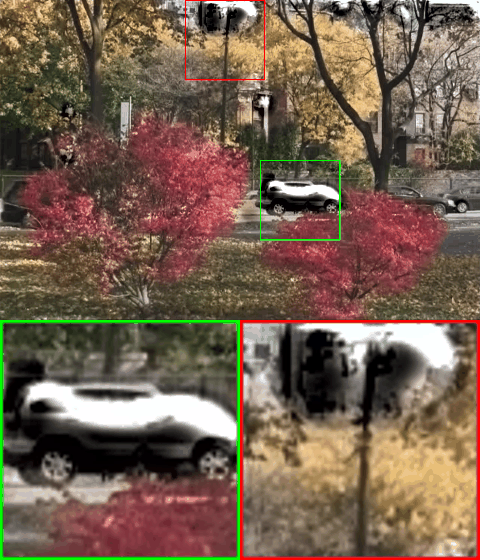

# Improving Video Colorization by Test-Time Tuning (ICIP'23)

In this repository we provide code of the paper:
> **Improving Video Colorization by Test-Time Tuning**
>
> Yaping Zhao, Haitian Zheng, Jiebo Luo, Edmund Y. Lam
>
> paper link: https://ieeexplore.ieee.org/abstract/document/10222579




## Dependencies

- [PyTorch (0.4.1+)](https://pytorch.org/) [torchvision](https://pytorch.org/docs/master/torchvision/)
- [FFmpeg (requires to be configured with --enable-libx264)](https://ffmpeg.org/)
- [opencv (3.4.1+)](https://opencv.org/)
- [scikit-image](https://scikit-image.org/)
- [tqdm](https://github.com/tqdm/tqdm)

For information on how to install PyTorch, please refer to the [PyTorch website](https://pytorch.org/). FFmpeg should be installed with libx264 support, which can be installed in Anaconda by using <code>conda install x264 ffmpeg -c conda-forge</code>.

## Usage

First, download the model by running the download script:

```
bash download_model.sh
```

To reproduce the main results from our paper, simply run:

```
python test_vid4.py
python test_set8.py
```

The input video will be automatically restored and colorized based on the reference color frames using the model. If you want to perform restoration only, use <code>--disable_colorization</code> option.

Other options:

- `--gpu`: Use GPU for the computation (**recommended**). Defaults to false.
- `--disable_colorization`: Disable colorization and only perform restoration with enhancement. Defaults to false.
- `--mindim`: Minimum edge dimension of the input video. Defaults to 320.


### Preparing Reference Images

To prepare reference color images for your own video, it is recommended to first extract reference frames from the video using a scene detection technique such as [pyscenedetect](https://pyscenedetect.readthedocs.io/en/latest/). Afterwards, colorize them by leveraging image editing software or recent interactive colorization techniques such as the [Interactive Deep Colorization [Zhang et al. 2017]](https://github.com/junyanz/interactive-deep-colorization/).

### Notes

- We recommend using GPU with 4GB+ memory for fast computation.
- Provided model and sample code are under a non-commercial creative commons license.

## Dataset

Pre-trained models are provided in the `input` folder. Therefore, <span style="color:red">**you can quickly get started without downloading datasets**</span>.


# Citation
Cite our paper if you find it interesting!
```
@inproceedings{zhao2023improving,
  title={Improving Video Colorization by Test-Time Tuning},
  author={Zhao, Yaping and Zheng, Haitian and Luo, Jiebo and Lam, Edmund Y},
  booktitle={2023 IEEE International Conference on Image Processing (ICIP)},
  pages={166--170},
  year={2023},
  organization={IEEE}
}
```

This code is implemented based on [DeepRemaster](https://github.com/vienhongquang/deepremastering).


